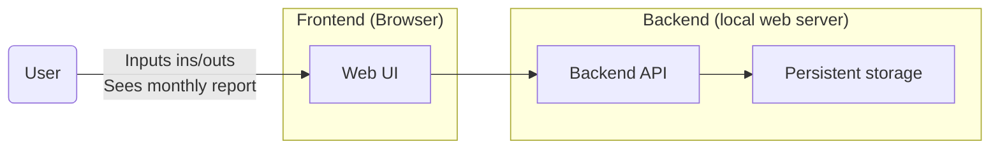

# Simple Budget (50/30/20)

Hobby tool to track monthly income / expenses and follow the [50/30/20 rule](https://en.wiktionary.org/wiki/50/30/20_rule). Built 
in the spare time to replace my Google Sheets.

## Overview

- Web app
- 1 household scale

### High-level diagram



**Tech stack**: Kotlin, TBD

### Demo

TBD

### Details

See more in [Simple Budget docs](docs/simple-budget-docs.md).

## Quick start

### Frontend

1. Install dependencies:
    ```shell
    npm install --prefix frontend
    ```
2. Build the frontend which will be served by Ktor:
    ```shell
    npm run watch --prefix frontend # or use `build` if hot reloading is not needed
    ```