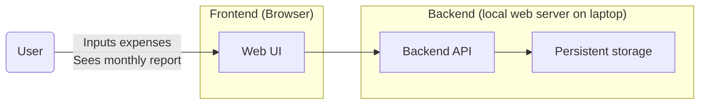

# Simple budget (50/30/20)

Hobby tool to track monthly income / expenses and follow the [50/30/20 rule](https://en.wiktionary.org/wiki/50/30/20_rule). Built 
in the spare time to replace my Google Sheets.

## Overview

- Web app
- 1 household scale

High-level diagram:

## Requirements

### Functional requirements

MVP: 
- CRUD (create-read-update-delete) monthly expenses
- Expense includes: *money*, *timestamp*, *category*, *comment*
- Categories: see [Appendix A](#appendix-a-expense-categories)

Out of scope:
- Income tracking

### Quality attributes

MVP: 
- Should just run on my laptop locally
- Does not involve sensitive data

### Appendix A: expense categories

| Category           | Type  |
|--------------------|-------|
| Fun / travel       | Wants |
| Groceries          | Needs |
| Health / wellbeing | Needs |
| Other needs        | Needs |
| Rent / utilities   | Needs |
| Restaurants        | Wants |
| Services           | Needs |
| Shopping           | Wants |
| Taxi               | Wants |
| Transportation     | Needs |
