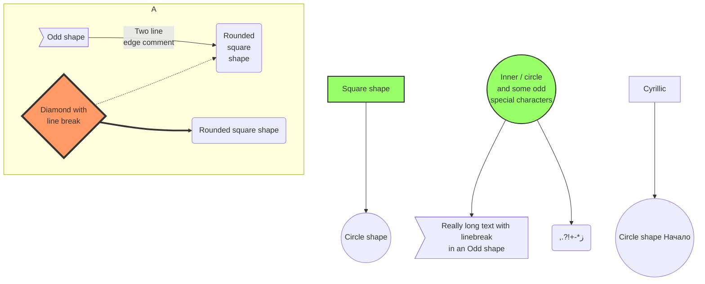

# Simple budget

Hobby tool to track monthly income / expenses and follow the [50/30/20 rule](https://en.wiktionary.org/wiki/50/30/20_rule). Built 
in the spare time to replace my Google Sheets.

## Overview

- Web app
- 1 household scale

### High-level diagram

TODO: actual diagram below

## System requirements

### Functional requirements

MVP: 
- CRUD (create-read-update-delete) monthly expenses
- Monthly expense: money, timestamp, category, comment 

### Quality attributes

MVP: should just run on my laptop locally
