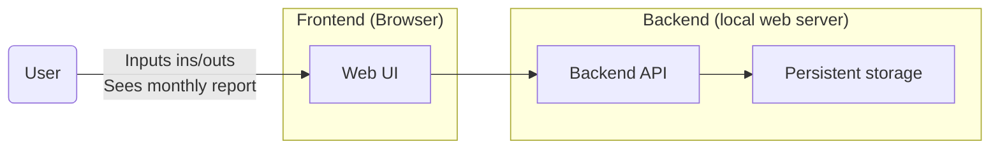
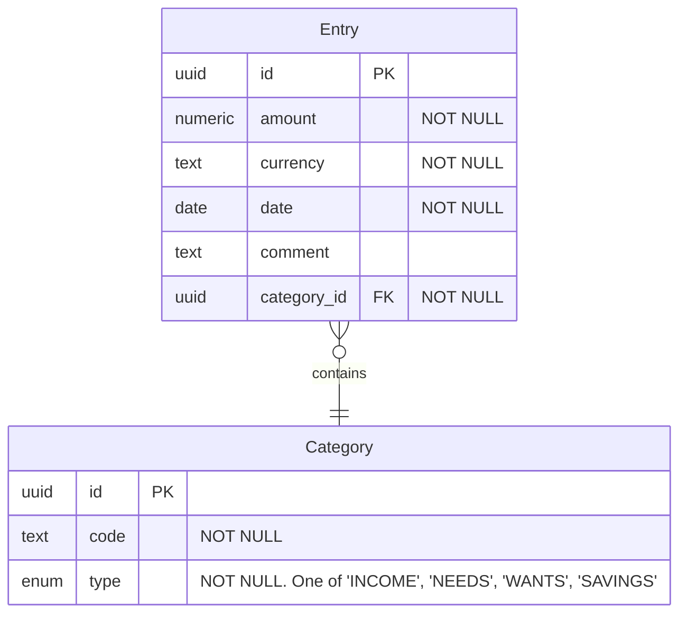
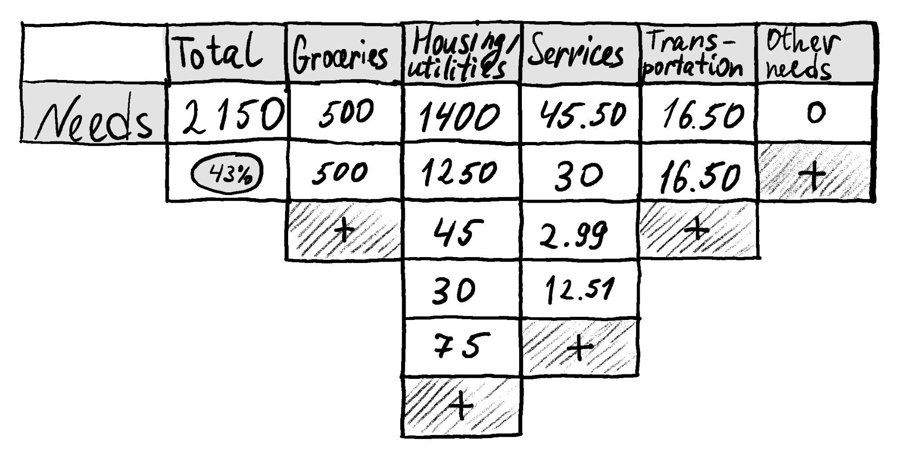

# Simple budget (50/30/20)

Hobby tool to track monthly income / expenses and follow the [50/30/20 rule](https://en.wiktionary.org/wiki/50/30/20_rule). Built 
in the spare time to replace my Google Sheets.

## Overview

- Web app
- 1 household scale

### High-level diagram



### Quick start


```shell
npm run dev --prefix frontend
```

## Requirements

### Functional requirements

MVP: 
- CRUD (create-read-update-delete) monthly income / expenses ("entries")
- Entry includes: *monetary value*, *date*, *category*, *comment*
- Categories: see [Appendix A](#a-entry-categories)

### Quality attributes

MVP: 
- Should just run on my laptop locally
- Does not involve sensitive data

## Technical details

### Entity relationship



Every entity may have metadata attributes like `created_at`, `updated_at`, `deleted_at`.

### API

See [docs/openapi.yaml (REST API)](docs/openapi.yaml).

## Appendix 

### A: Categories

| Category            | Type   |
|---------------------|--------|
| Dividends           | Income |
| Salary              | Income |
| Other income        | Income |
| Groceries           | Needs  |
| Health / wellbeing  | Needs  |
| Housing / utilities | Needs  |
| Other needs         | Needs  |
| Services            | Needs  |
| Transportation      | Needs  |
| Fun / travel        | Wants  |
| Other wants         | Wants  |
| Restaurants         | Wants  |
| Shopping            | Wants  |
| Taxi                | Wants  |

### B: Concept art

