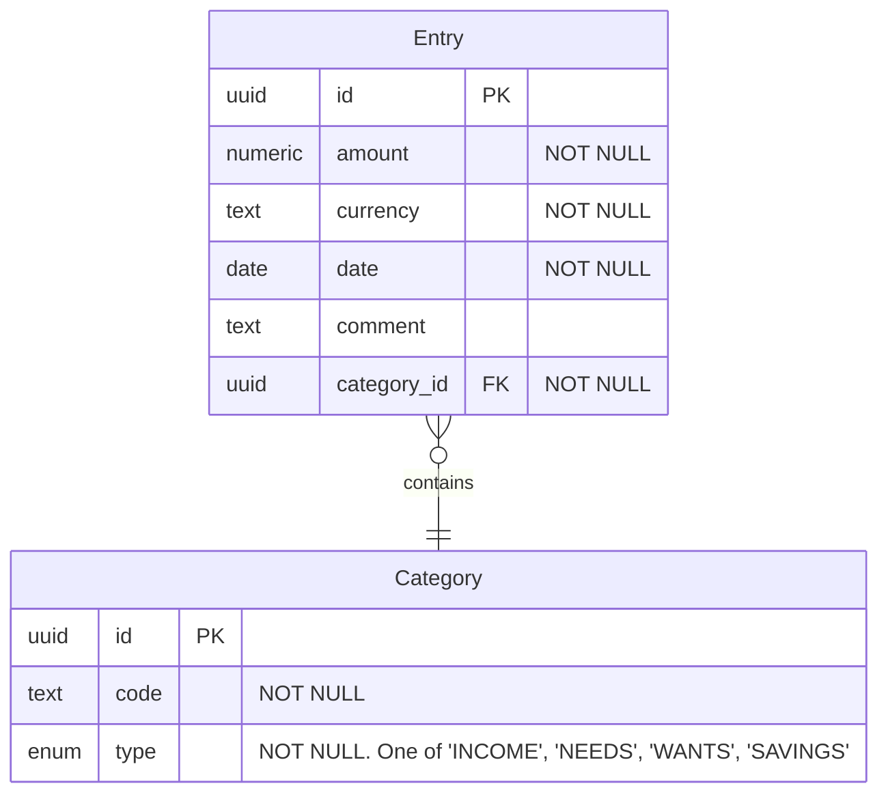

# Simple Budget docs

## Requirements

### Functional requirements

MVP:
- CRUD (create-read-update-delete) monthly income / savings / needs / wants ("entries")
- Entry includes: *monetary value*, *date*, *category*, *comment*
- Categories: see [Appendix A](#a-categories)

### Quality attributes

MVP:
- Should just run on my laptop locally
- Does not involve sensitive data

## Technical details

### Entity relationship

Every entity may have metadata attributes like `created_at`, `updated_at`, `deleted_at`.

### API

See [docs/openapi.yaml (REST API)](docs/openapi.yaml).

## Appendix 

### A: Categories

| Category            | Type    |
|---------------------|---------|
| Dividends           | Income  |
| Salary              | Income  |
| Other income        | Income  |
| Savings             | Savings |
| Groceries           | Needs   |
| Health / wellbeing  | Needs   |
| Housing / utilities | Needs   |
| Other needs         | Needs   |
| Transportation      | Needs   |
| Charity             | Wants   |
| Fun / travel        | Wants   |
| Other wants         | Wants   |
| Restaurants         | Wants   |
| Shopping            | Wants   |
| Subscriptions       | Wants   |
| Taxi                | Wants   |